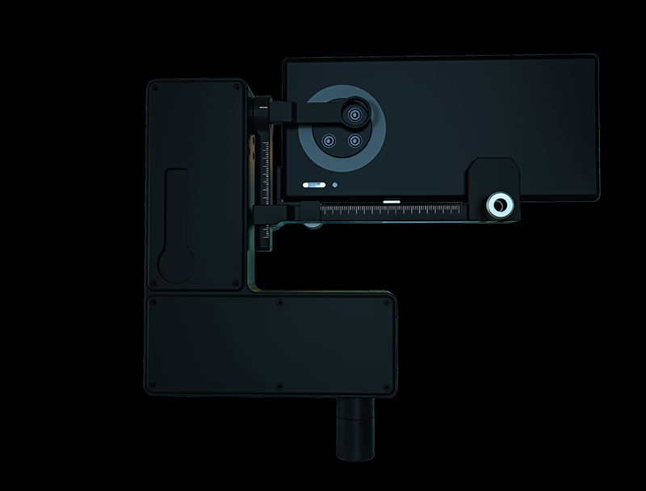
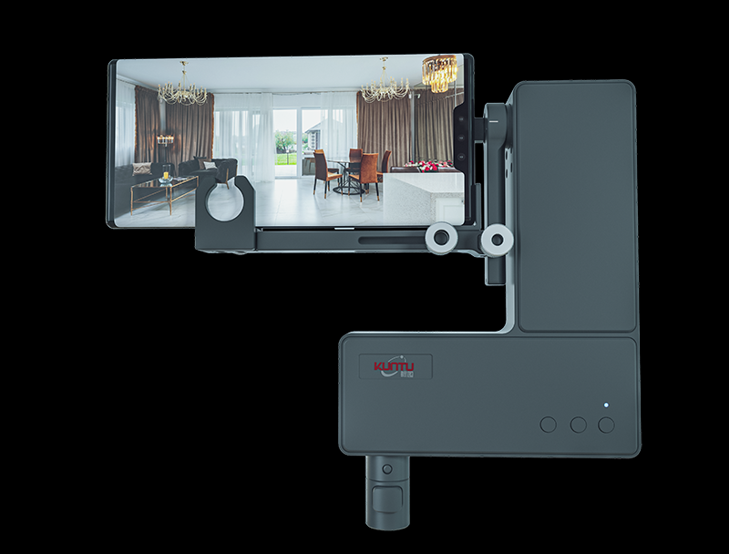
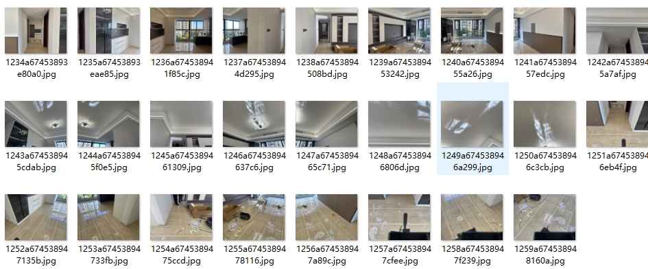
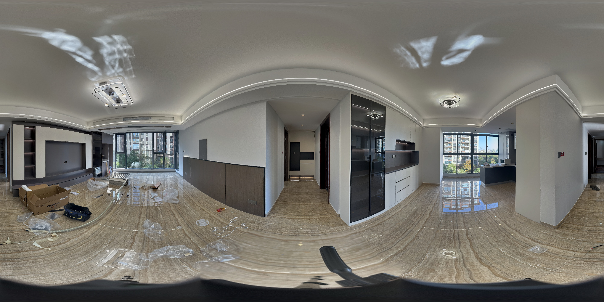

# Project Name  
Image Stitching on Mobile with Hugin  

## Introduction  
This project brings Hugin's image stitching capabilities to mobile platforms, enabling panorama creation directly on Android devices. By porting the Hugin project to Android, users can stitch multiple images into a panoramic image on their phones.  

## Features  
- **Image Capture**: Use the Kuntu mobile panoramic gimbal to capture aligned images as stitching input.  
- **Seamless Stitching**: Import captured images into the app and create panoramic images directly on mobile devices.  

[](https://kuntu720.taobao.com)  <br>
[](https://kuntu720.taobao.com)  <br>

#### Source Images  
  <br>

#### Stitching Result  
  <br>

### Installation Steps  
1. Clone the repository:  
   ```bash  
   git clone https://github.com/som-lgtm/hugin-mobile.git  

References<br>
hugin (https://sourceforge.net/projects/hugin/)<br>
multiblend (https://horman.net/multiblend/)


# 项目名称
利用hugin实现移动端图片拼接

## 简介
利用hugin实现移动端图片拼接，基于android平台，把hugin项目移植到安卓平台实现图片拼接成全景图

## 功能特点
素材采集采用鲲图手机全景云台对素材采集，然后把素材导入项目实现移动端完成全景图拼接
[](https://kuntu720.taobao.com)<br>
[](https://kuntu720.taobao.com)<br>
[]<br>
[]<br>


### 安装步骤
1. 克隆仓库：
   ```bash
   git clone https://github.com/som-lgtm/hugin-mobile.git

## 引用
hugin (https://sourceforge.net/projects/hugin/)<br>
multiblend (https://horman.net/multiblend/)
